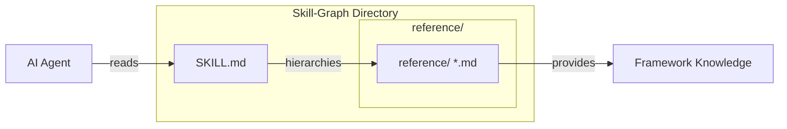

# AGENTS.md - Skill Graphs Context

## Tech Stack & Architecture
- **Language**: Python 3.10+
- **Architecture**: A specialized library of "Documentation Skills" (Skill-Graphs). Each graph is a directory containing a structured `SKILL.md` index and a `reference/` directory with crawled/transformed markdown.
- **Discovery**: Skill-graphs are discovered and managed via `skill_graphs.skill_graph_utilities`.
- **Key Principles**:
    - **Knowledge-Centric**: Every skill-graph is an indexed documentation set for a specific technology, framework, or site.
    - **Searchable**: `SKILL.md` acts as a hierarchical Table of Contents for agents to quickly locate relevant reference files.
    - **Composable**: Agents can load multiple documentation graphs simultaneously to build their internal context.

## Skill-Graph Architecture Diagram


## Commands (run these exactly)
# Installation
pip install -e "."

# Development
ruff check --fix .
ruff format .

## Project Structure Quick Reference
- `skill_graphs/` → The core package containing documentation skills.
- `skill_graphs/skill_graph_utilities.py` → Logic for discovering skill-graph paths and checking ENABLE flags.
- `pyproject.toml` → Package configuration and dependencies.

## File Tree (Top Level)
```text
.
├── skill_graphs/
│   ├── skill_graphs/          # All documentation skill-graphs
│   │   ├── pydantic-ai-docs/
│   │   ├── fastapi-docs/
│   │   └── ...
│   ├── skill_graph_utilities.py # Utilities for loading graphs
│   └── __init__.py
├── README.md
├── AGENTS.md
└── pyproject.toml
```

## Conventions for documentation Skills
**Always:**
- Ensure every skill-graph has a `SKILL.md` with a clean Table of Contents.
- Use the `target-type="skill-graphs"` when generating with `skill-graph-builder`.
- Group related documentation under clear subdirectories in `reference/`.
- Maintain the `-docs` suffix for all skill-graph folder names.

## Dos and Don't s
**Do:**
- Use the `skill-graph-builder` script from `universal-skills` to populate this repo.
- Verify that links in `SKILL.md` correctly point to files in the `reference/` folder.
- Follow a consistent kebab-case naming for skill directories.

**Don't:**
- Include raw code scripts here; this repo is for indexed documentation only.
- Commit massive, un-split markdown files (use `max-file-kb` in the builder).

## Safety & Boundaries
**Always do:**
- Ensure that the knowledge captured is accurate and comes from trusted sources listed in `source_url`.
- Respect robots.txt and crawling limits when generating new graphs.

**Ask first:**
- Before adding extremely large documentation sets (multi-GB).
- Before changing the core loading logic in `skill_graph_utilities.py`.

## When Stuck
- Check `README.md` for specific environment variable flags to enable/disable graphs.
- Consult `skill_graph_utilities.py` to understand how paths are resolved.
- Looking for how to build a graph? See `skill-graph-builder` in `universal-skills`.
```
