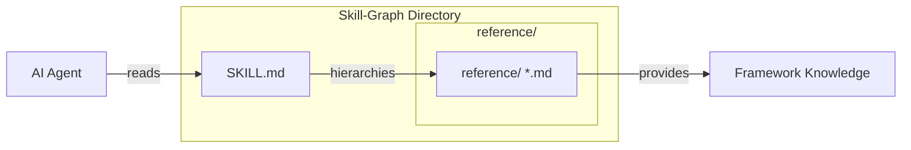

# AGENTS.md - Skill Graphs Context

## Tech Stack & Architecture
- **Language**: Python 3.10+
- **Architecture**: A specialized library of "Documentation Skills" (Skill-Graphs). Each graph is a directory containing a structured `SKILL.md` index and a `reference/` directory with crawled/transformed markdown.
- **Discovery**: Skill-graphs are discovered and managed via `skill_graphs.skill_graph_utilities`.
- **Key Principles**:
    - **Knowledge-Centric**: Every skill-graph is an indexed documentation set for a specific technology, framework, or site.
    - **Searchable**: `SKILL.md` acts as a hierarchical Table of Contents for agents to quickly locate relevant reference files.
    - **Composable**: Agents can load multiple documentation graphs simultaneously to build their internal context.

## Skill-Graph Architecture Diagram

```mermaid
graph LR
    Agent[AI Agent] -- reads --> SkillMD[SKILL.md]
    SkillMD -- hierarchies --> Ref[reference/ *.md]
    Ref -- provides --> Knowledge[Framework Knowledge]
    subgraph SkillGraphFolder [Skill-Graph Directory]
        SkillMD
        subgraph Reference [reference/]
            Ref
        end
    end
```

## Commands (run these exactly)
# Installation
pip install -e "."

# Development
ruff check --fix .
ruff format .

## Project Structure Quick Reference
- `skill_graphs/` → The core package containing documentation skills.
- `skill_graphs/skill_graph_utilities.py` → Logic for discovering skill-graph paths and checking ENABLE flags.
- `pyproject.toml` → Package configuration and dependencies.

## File Tree (Top Level)
```text
.
├── skill_graphs/
│   ├── skill_graphs/          # All documentation skill-graphs
│   │   ├── pydantic-ai-docs/
│   │   ├── fastapi-docs/
│   │   └── ...
│   ├── skill_graph_utilities.py # Utilities for loading graphs
│   └── __init__.py
├── README.md
├── AGENTS.md
└── pyproject.toml
```

## Conventions for documentation Skills
**Always:**
- Ensure every skill-graph has a `SKILL.md` with a clean Table of Contents.
- Use the `target-type="skill-graphs"` when generating with `skill-graph-builder`.
- Group related documentation under clear subdirectories in `reference/`.
- Maintain the `-docs` suffix for all skill-graph folder names.

## Dos and Don't s
**Do:**
- Use the `skill-graph-builder` script from `universal-skills` to populate this repo.
- Verify that links in `SKILL.md` correctly point to files in the `reference/` folder.
- Follow a consistent kebab-case naming for skill directories.

**Don't:**
- Include raw code scripts here; this repo is for indexed documentation only.
- Commit massive, un-split markdown files (use `max-file-kb` in the builder).

## Safety & Boundaries
**Always do:**
- Ensure that the knowledge captured is accurate and comes from trusted sources listed in `source_url`.
- Respect robots.txt and crawling limits when generating new graphs.

**Ask first:**
- Before adding extremely large documentation sets (multi-GB).
- Before changing the core loading logic in `skill_graph_utilities.py`.

## When Stuck
- Check `README.md` for specific environment variable flags to enable/disable graphs.
- Consult `skill_graph_utilities.py` to understand how paths are resolved.
- Looking for how to build a graph? See `skill-graph-builder` in `universal-skills`.
```

## ⛔ No Scratch or Temporary Files in Repository

**NEVER write any of the following to this repository:**
- Temporary test scripts (`test_*.py`, `debug_*.py` outside of `tests/`)
- Scratch scripts or experimental one-off files
- Log files (`.log`, `.txt` command output)
- Random text files with command output or debug dumps
- Any file that is NOT production source code, tests in `tests/`, or documentation

**Why:** These files expose private filesystem paths, credentials, and internal infrastructure details when pushed to GitHub publicly.

**Where to put scratch work instead:**
- Use `~/workspace/scratch/` for temporary scripts and experiments
- Use `~/workspace/reports/` for command output and reports
- Keep test scripts in the `tests/` directory following proper pytest conventions

## Working Discipline — think, simplify, stay surgical, verify

These four habits cut the most common LLM coding mistakes. For trivial tasks, use
judgment; the bias here is correctness over speed.

- **Think before coding.** State your assumptions explicitly. If a request has more than
  one reasonable reading, surface the options instead of silently picking one. If a
  simpler approach exists, say so and push back when warranted. When something is
  genuinely unclear, stop and name what's confusing — ask, don't guess.
- **Simplicity first.** Write the minimum code that solves the stated problem — no
  speculative features, no abstraction for single-use code, no configurability that
  wasn't requested, no error handling for impossible states. If you wrote 200 lines and
  it could be 50, rewrite it. (Name code from its purpose, never `wave0`/`phase2`/`v2`.)
- **Stay surgical.** Every changed line should trace directly to the task. Don't refactor,
  reformat, or "improve" working code adjacent to your change; match the existing style
  even where you'd do it differently. Remove only the imports/symbols your own change
  orphaned; if you spot unrelated dead code, mention it rather than deleting it inline.
  *Exception — the Quality Bar below:* lint/format/type errors the pre-commit gate flags
  get fixed regardless of who introduced them. In short: **surgical on behavior, clean on
  lint.**
- **Verify against a goal.** Turn the task into a checkable outcome before you start:
  "fix the bug" → "write a failing test that reproduces it, then make it pass"; "add
  validation" → "tests for the invalid inputs pass". For multi-step work, state the short
  plan and the check for each step, then loop until the checks pass.

## Quality Bar — Leave the Codebase Clean (REQUIRED)

After completing any code change, run the project's pre-commit suite and drive it
**fully green** before committing:

```bash
pre-commit run --all-files
```

Resolve **every** issue it reports — failures, lint errors, type errors, and
warnings — **including problems that pre-date your change and were not caused by
your edits**. The standing goal is a clean, working codebase with **no errors and
no warnings**. Do not silence checks (`# noqa`, `# type: ignore`, `SKIP=`,
`--no-verify`) to force green unless the exception is already documented in this
file as a known, unavoidable limitation. Only commit once `pre-commit run
--all-files` passes cleanly; if a check legitimately cannot pass, stop and explain
why rather than bypassing it.

## Working with Git Worktrees (multi-session)

Multiple agents/sessions work the `agent-packages/*` repos concurrently. **Do not
edit the canonical checkout** (`${AGENT_UTILITIES_WORKSPACE_ROOT}/agent-packages/<repo>`) — a
background `repository-manager` sync can reset its working tree and discard
uncommitted edits. Take your own git worktree on your own branch instead:

```bash
# preferred — repository-manager MCP:
rm_worktree add <repo> <your-branch>      # -> ${AGENT_WORKTREE_ROOT}/<repo>/<your-branch>

# raw-git fallback:
git -C agent-packages/<repo> checkout main
git -C agent-packages/<repo> worktree add ${AGENT_WORKTREE_ROOT}/<repo>/<branch> -b <branch>
```

Work in the worktree and **commit often** (commits survive a working-tree reset).
Each session must use a **distinct branch** — git allows a branch in only one
worktree, which is what keeps concurrent sessions from colliding. Worktrees live
under `${AGENT_WORKTREE_ROOT}/` (outside the workspace scan, so the sync leaves them
alone).

**Finishing work in a worktree** — run this sequence before calling it done:
1. **Pre-commit green** — `pre-commit run --all-files`; resolve every issue per the
   Quality Bar above (including pre-existing), no `--no-verify`.
2. **Commit** in the worktree.
3. **Merge to main locally** — `rm_worktree merge <repo> <branch> --into main`
   (or `git merge --no-ff`). Push only when the user asks.
4. **Clean up** — remove the worktree and delete the merged branch:
   `rm_worktree remove <repo> <branch> --delete-branch`; `rm_worktree prune` clears
   stale entries. (Raw-git: `git worktree remove <path> && git branch -d <branch>`.)
